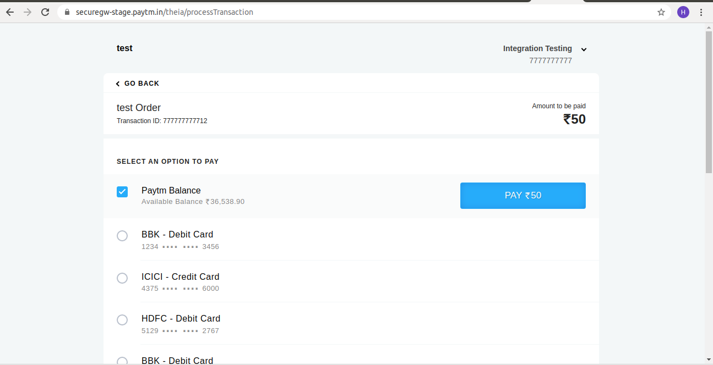

## **PayTm Integration with Laravel.**

Here we are going to implement PayTM with Laravel. Laravel provides inbuilt PayTM library. So, We will use it for integration.

**1) Make Laravel project**

We will make one laravel project by below command:

    composer create-project --prefer-dist laravel/laravel laraPayTM
    

**2) Install PayTM package**

We will install PayTM package by below command:

    composer require anandsiddharth/laravel-paytm-wallet
    
After successfully install package, open `config/app.php` file and add service provider.

    'providers' => [
    
    	....
    
    	Anand\LaravelPaytmWallet\PaytmWalletServiceProvider::class,
    
    ],
    
    'aliases' => [
    
    	....
    
    	'PaytmWallet' => Anand\LaravelPaytmWallet\Facades\PaytmWallet::class,
    
    ],
    
After this, we will configure `config/services.php` file  like below:

    <?php
    
    
    return [
    
    
        ......
        'paytm-wallet' => [
            'env' => 'local', 
            'merchant_id' => env('YOUR_MERCHANT_ID'),
            'merchant_key' => env('YOUR_MERCHANT_KEY'),
            'merchant_website' => env('YOUR_WEBSITE'),
            'channel' => env('YOUR_CHANNEL'),
            'industry_type' => env('YOUR_INDUSTRY_TYPE'),
        ],
    
    
    ];
    
Now we will add that variable on `.env` file. and will make payTM account and will take API keys from that.

    YOUR_MERCHANT_ID=your_merchant_id
    
    YOUR_MERCHANT_KEY=your_merchant_key
    
    YOUR_WEBSITE=WEBSTAGING
    
    YOUR_CHANNEL=WEB
    
    YOUR_INDUSTRY_TYPE=Retail
    
**3) Create Event Table and Model**

We will make one event table and model by below command
     
    php artisan make:model EventRegistration -m
    
Now we will add below code to our event migration file `database/migrations/2020_02_21_085007_create_event_registration_table.php`

    <?php
    
    
    use Illuminate\Support\Facades\Schema;
    use Illuminate\Database\Schema\Blueprint;
    use Illuminate\Database\Migrations\Migration;
    
    
    class CreateEventRegistrationTable extends Migration
    {
        /**
         * Run the migrations.
         *
         * @return void
         */
        public function up()
        {
            Schema::create('event_registration', function (Blueprint $table) {
                $table->increments('id');
                $table->string('name');
                $table->string('mobile_no');
                $table->text('address');
                $table->tinyInteger('status')->default(0);
                $table->integer('fee');
                $table->string('order_id');
                $table->string('transaction_id')->default(0);
                $table->timestamps();
            });
        }
    
    
        /**
         * Reverse the migrations.
         *
         * @return void
         */
        public function down()
        {
            Schema::drop("event_registration");
        }
        
    }
    
 Now, we will do migration.
 
    php artisan migrate
    

Now, in model file, add below code.

    <?php
    
    
    namespace App;
    
    
    use Illuminate\Database\Eloquent\Model;
    
    
    class EventRegistration extends Model
    {
        protected $table = 'event_registration'
    
    
        protected $fillable = ['name','mobile_no','address','status','fee','order_id','transaction_id'];
    
    }
    
**4) Add routes**   

Now we will add routes for event.

    Route::get('event', 'OrderController@register'); 
    Route::post('payment', 'OrderController@order');
    Route::post('payment/status', 'OrderController@paymentCallback');
    
Now, make controller file by below command:

    php artisan make:controller OrderController
    
**5) Create Controller** 
    
Add below code to Controller file

    <?php
    
    namespace App\Http\Controllers;
    
    
    use PaytmWallet;
    
    use Illuminate\Http\Request;
    
    use App\EventRegistration;
    
    
    class OrderController extends Controller
    
    {
    
    
        /**
    
         * Redirect the user to the Payment Gateway.
    
         *
    
         * @return Response
    
         */
    
        public function register()
    
        {
    
            return view('register');
    
        }
    
    
        /**
    
         * Redirect the user to the Payment Gateway.
    
         *
    
         * @return Response
    
         */
    
        public function order(Request $request)
    
        {
    
    
            $this->validate($request, [
    
                'name' => 'required',
    
                'mobile_no' => 'required|numeric|digits:10',
    
                'address' => 'required',
    
            ]);
    
    
            $input = $request->all();
    
            $input['order_id'] = $request->mobile_no.rand(1,100);
    
            $input['fee'] = 50;
    
    
            EventRegistration::create($input);
    
    
            $payment = PaytmWallet::with('receive');
    
            $payment->prepare([
    
                'order' => $input['order_id'],
    
                'user' => '4567', //Any random number for test
    
                'mobile_number' => 'your paytm number',
    
                'email' => 'your paytm email',
    
                'amount' => $input['fee'],
    
                'callback_url' => url('payment/status')
    
            ]);
    
            return $payment->receive();
    
        }
    
    
        /**
    
         * Obtain the payment information.
    
         *
    
         * @return Object
    
         */
    
        public function paymentCallback()
    
        {
    
            $transaction = PaytmWallet::with('receive');
    
    
            $response = $transaction->response();
    
            $order_id = $transaction->getOrderId();
    
    
            if($transaction->isSuccessful()){
    
                EventRegistration::where('order_id',$order_id)->update(['status'=>2, 'transaction_id'=>$transaction->getTransactionId()]);
    
    
                dd('Payment Successfully Paid.');
    
            }else if($transaction->isFailed()){
    
                EventRegistration::where('order_id',$order_id)->update(['status'=>1, 'transaction_id'=>$transaction->getTransactionId()]);
    
                dd('Payment Failed.');
    
            }
    
        }
    
    }

        
**6) Make view file**

We will make view file `resources/view/register.blade.php`.

    <!DOCTYPE html>
    
    <html>
    
    <head>
    
        <title>Laravel - Payment gateway using Paytm</title>
    
        <link href="https://maxcdn.bootstrapcdn.com/bootstrap/3.3.6/css/bootstrap.min.css" rel="stylesheet">
    
    </head>
    
    <body>
    
    
    

    
        

    
            
<h2 class="text-center">Laravel - Pay by Paytm</h2>

    
            

    
                <form action="{{ url('payment') }}" class="form-image-upload" method="POST" enctype="multipart/form-data">
    
    
                    {!! csrf_field() !!}
    
    
                    @if (count($errors) > 0)
    
                        

    
                            <strong>Whoops!</strong> There were some problems with your input.  
    
                            <ul>
    
                                @foreach ($errors->all() as $error)
    
                                    <li>{{ $error }}</li>
    
                                @endforeach
    
                            </ul>
    
                        

    
                    @endif
    
    
                    

    
                        

    
                            <strong>Name:</strong>
    
                            <input type="text" name="name" class="form-control" placeholder="Name">
    
                        

    
                        

    
                            <strong>Mobile No:</strong>
    
                            <input type="text" name="mobile_no" class="form-control" placeholder="Mobile No.">
    
                        

    
                        

    
                            <strong>Address:</strong>
    
                            <textarea class="form-control" placeholder="Address" name="address"></textarea>
    
                        

    
    
                        

    
                             
    
                            <button type="submit" class="btn btn-success btn-block">Pay to PayTM(Rs. 50)</button>
    
                        

    
                    

    
    
                </form>
    
            

    
        

    
    

    
    
    </body>
    
    </html>

Now, run below command for pay by PayTM.

    php artisan serve
    
and add below url to browser

    http://127.0.0.1:8000/event-registration
    
It will show you below screen

  

Add your registration detail and it will redirect you to below screen:

 

Select Paytm and add your mobile number and proceed it and One OTP sent to your mobile number. add that otp to below screen

And now it will redirect you to below screen and press Pay button for Pay by PayTM.

 

    
    

